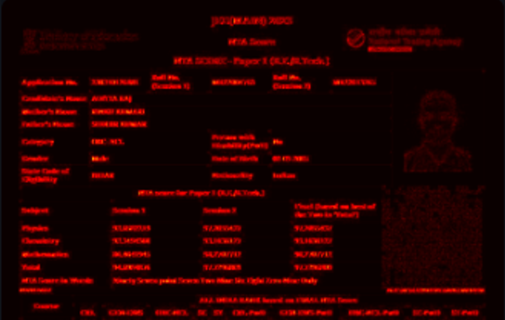

# AIShield – Multi‑Modal KYC Fraud Detection Engine

*A transparent, explainable, and deepfake‑resistant identity verification system.*

---

## 🌐 Overview

AIShield is a production‑ready, multi‑modal KYC fraud detection engine designed to stop the latest wave of AI‑generated identity attacks—ranging from forged ID documents to deepfake selfie videos. Instead of relying on a single verification signal, AIShield analyzes **document forensics**, **biometric liveness**, **anti‑spoof patterns**, and **face‑embedding similarity** before producing a final, explainable fraud score.

The system is built end‑to‑end with a **FastAPI backend**, a clean and intuitive **Streamlit UI**, and a compact but powerful collection of AI models. Every verification generates an **audit‑ready case log** with heatmaps, SHAP explanations, and key metrics to support regulatory review.

This repository contains the complete implementation of AIShield used for the GHCI 2025 Hackathon submission.

---

## 🚀 Key Features

### **1. Hybrid Document Forgery Detection (ELA + CNN)**

* Error Level Analysis detects recompression artifacts and local tampering.
* EfficientNet‑B0–based classifier identifies subtle visual inconsistencies.
* Final `doc_score` combines both signals.
* Heatmaps highlight manipulated regions.

### **2. Biometric Liveness & Anti‑Spoofing**

* Extracts 5–10 frames from selfie video.
* Motion + blink cues using facial landmarks.
* Lightweight FFT‑based anti‑spoof model to catch screen replays & deepfakes.
* Outputs `liveness_score` and `deepfake_score`.

### **3. Face Embedding Matching**

* Uses high‑dimensional facial embeddings to match ID photo to selfie.
* Robust against lighting changes and slight posture variations.

### **4. Fusion Risk Engine with Explainability**

* LightGBM model fuses all signals into a single fraud probability.
* SHAP explanations show contribution of each feature.

### **5. Admin Dashboard + Audit Logs**

* Each verification becomes a structured JSON case log.
* Inspect heatmaps, SHAP scores, detailed metrics.
* Download evidence for compliance.

---

## 🏗️ Architecture

```
User → Streamlit UI → FastAPI Backend →
   [Document Forensics]    → doc_score
   [Liveness Engine]       → liveness_score
   [Embedding Matching]    → embed_similarity
→ LightGBM Fusion → Final Fraud Score + SHAP
→ Audit Log → Admin Dashboard
```

---

## 📂 Repository Structure

```
aishield/
├── backend/
│   ├── app.py                # FastAPI server with all endpoints
│   ├── models.py             # ELA, liveness, embeddings helper functions
│   ├── audit_logger.py       # Case logging with auto-incrementing case numbers
│   ├── compliance_config.py  # GDPR/KYC compliance settings
│   ├── deepfake_detector.py  # FFT-based anti-spoof detection
│   ├── antispoof_detector.py # Liveness detection with motion analysis
│   ├── cleanup.py            # Resource cleanup utilities
│   ├── dataset/              # Training data (clean/forged IDs)
│   ├── models/               # Trained models (CNN + Fusion LightGBM)
│   ├── logs/                 # JSON audit logs (generated at runtime)
│   ├── outputs/              # Temporary processing files
│   ├── requirements.txt      # Python dependencies
│   └── Dockerfile            # Container configuration
├── frontend/
│   ├── app.py                # Streamlit UI (User + Admin modes)
│   └── requirements.txt      # Frontend dependencies
├── docker-compose.yml        # Optional container orchestration
├── start_backend.bat         # Quick start script for backend
├── start_frontend.bat        # Quick start script for frontend
└── README.md                 # You are here
```

---

## 🔧 Installation & Setup

### **1. Clone the Repository**

```
git clone https://github.com/Aditya-46-Raj/aishield
cd aishield
```

### **2. Run Backend (FastAPI)**

**Option A: Using startup script (Recommended for Windows)**
```
start_backend.bat
```

**Option B: Manual start**
```
cd backend
pip install -r requirements.txt
python -m uvicorn app:app --host 0.0.0.0 --port 8000 --reload
```

Backend runs on: **[http://localhost:8000](http://localhost:8000)**

### **3. Run Frontend (Streamlit)**

**Option A: Using startup script (Recommended for Windows)**
```
start_frontend.bat
```

**Option B: Manual start**
```
cd frontend
pip install -r requirements.txt
streamlit run app.py --server.port 8501
```

Frontend runs on: **[http://localhost:8501](http://localhost:8501)**

---

## 📊 How the Verification Pipeline Works

### **Step 1 — Document Upload**

* ELA image and difference map computed.
* CNN runs forgery classification.
* Combined: `doc_score`.

### **Step 2 — Video/Liveness Upload**

* Video → frames → motion analysis.
* Anti‑spoof deepfake scoring.
* Combined: `liveness_score`.

### **Step 3 — Face Embedding Matching**

* ID photo ↔ Selfie embeddings.
* Output: `embed_similarity`.

### **Step 4 — Fusion Model**

* Merges doc + liveness + embedding.
* Produces `fused_fraud_prob`.

### **Step 5 — Explainability & Logs**

* SHAP bar graph.
* ELA heatmap.
* Complete JSON case log.

---

## 📑 Audit Logs

* Located in: `backend/logs/`
* Automatically generated at each verification.
* Contains:

  * Individual scores
  * SHAP contributions
  * Document heatmap path
  * Timestamps & case ID

A small README inside the logs folder explains its purpose.

---

## 🖥️ Screenshots

* SHAP Explanation Plot


* Liveness / Deepfake Result


* Document Forgery Heatmap


* Admin Dashboard View

---

## 📹 Demo Video

Link:- **[Prototype Demo](https://youtu.be/Q1X40Mtz6UQ)**

---

## 💡 Why AIShield Stands Out

* Multi‑modal analysis instead of single‑signal checks
* Transparent & explainable (SHAP, heatmaps, logs)
* Deepfake‑resistant liveness detection
* Realistic architecture built for scalability
* Clean UI + Admin console for compliance teams

---

## 📘 License

This project is built solely for the GHCI 2025 Hackathon (Non‑commercial demonstration).

---

## 🤝 Contributors

**Aditya Raj lead(Team 0AI)** – Design, development, model integration, UI, backend, testing, and architecture.

AIShield represents a complete multi‑modal approach to secure digital onboarding — combining transparency, technical rigor, and practical deployability.
